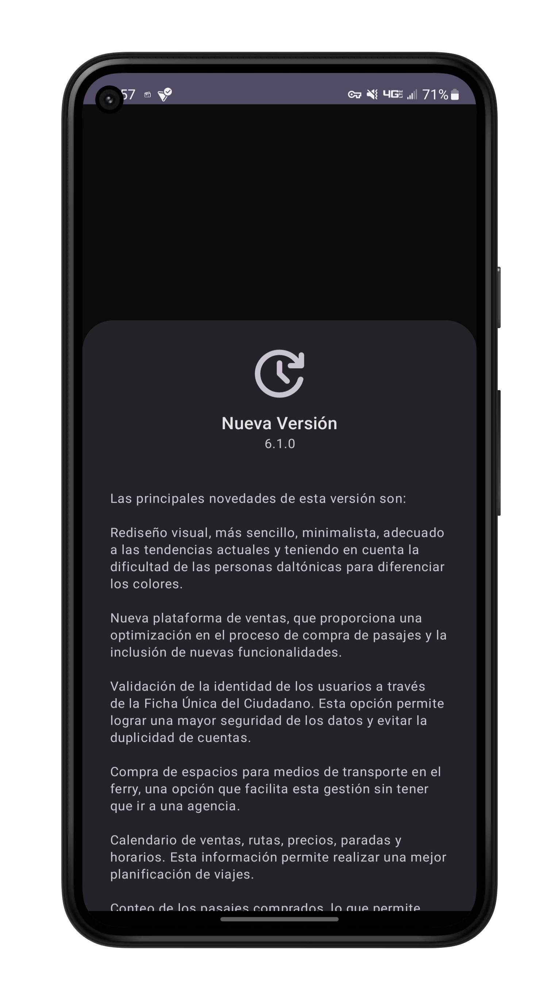

## ApklisApi 🦋
Una libreria para comprobar nuevas actualizaciones de aplicaciones en Apklis, así como la comprobación de compra de aplicaciones en dicha tienda.


La librería fue creada basándose en la original creada para Kotlin
[ApklisUpdate](https://github.com/Z17-CU/apklisupdate)

<p align="center">

<h3>Ejemplo</h3>



</p>


### Agregar 
1. Agregar en la raiz de su proyecto

```groovy
repositories {
   mavenCentral()
    maven { url 'https://jitpack.io' }
}
```

2. Agregar en su `build.gradle`
```groovy
implementation 'com.github.m4gen:apklisapi:1.0.0-alpha2'
```

### Uso
📝 Comprobar si existe una nueva versión en Apklis debe usar `ApklisUpdate` 

```java
ApklisUpdate api = new ApklisUpdate(this);
api.checkLastUpdate(PACKAGE_NAME, new UpdateCallback() {
@Override
public void onLastUpdate(LastRelease info) {
/* En caso de existir una nueva version LastRelease
 * arroja la información de esa nueva versión
 */ 
}
@Override
public void onError(Exception e) {
// error 
   }
});
```

Desde `LastRelease` podrá extraer información como:

`info.versionName(); // String` 
`info.versionCode(); // int`
`info.appSize(); // int`
`info.appChangelog(); // String`

💳 Comprobar compra de la aplicación

```java
ApklisPay paid = new ApklisPay(this, this.getPackageName());
if (paid.isPaid()) {
    Toast.makeText(this, "App pagada", Toast.LENGTH_LONG).show();
} else {
    Toast.makeText(this, "App No pagada", Toast.LENGTH_LONG).show();
}

```

### Extra
La librería también incluye una vista personalizada con la información de la nueva versión, pero no es obligatorio usarla, usted puede crear su propia lógica, ya sea un AlertDialog, Notificación o Fragment, ponga su imaginación a volar.

Modo de uso de la [vista](https://github.com/m4gen/apklisapi/blob/main/app/src/main/java/com/arr/example/MainActivity.java) personalizada:
```java
Spanned changelog = formatHtmlString(info.appChangelog());

new ApklisUpdateDialog(MainActivity.this)
 .setTitle("Nueva Versión")
 .setVersion(info.versionName())
 .setChangelog(changelog.toString())
 .show();


private Spanned formatHtmlString(String htmlString) {
if (android.os.Build.VERSION.SDK_INT >= android.os.Build.VERSION_CODES.N) {
   return Html.fromHtml(htmlString, Html.FROM_HTML_MODE_LEGACY);
} else {
   return Html.fromHtml(htmlString);
     }
}
```

### Contacto

Si tiene aguna duda o sugerencia me puede contactar a:

alessrodriguez98@gmail.com
